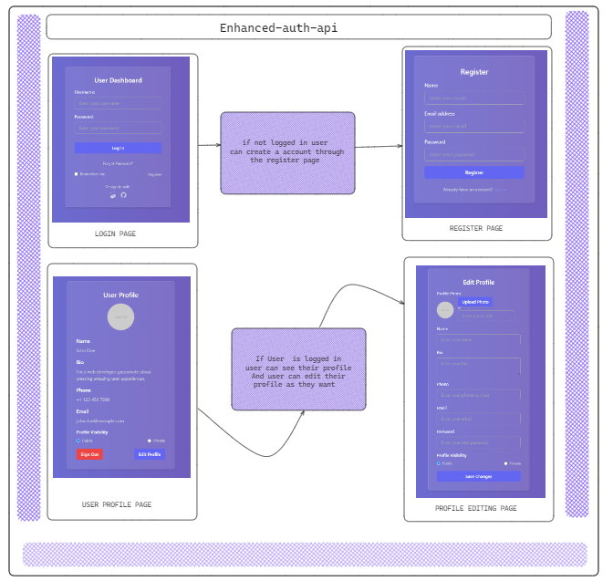

# Enhanced Auth API

The Enhanced Auth API is a web application that provides enhanced authentication features, including user registration, login, profile management, and session management.

## Technologies Used

- Node.js
- Express.js
- MongoDB
- HTML
- Tailwind CSS
- JavaScript

## Features

- User registration
- User login with JWT authentication
- Profile management
- Session management
- Public and private profile visibility settings





## Setup

## Clone the repository:

```bash
git clone https://github.com/SHIV000000/enhanced-auth-api.git
```
```bash
cd enhanced-auth-api
```
## Install dependencies:

```bash
npm install
```
## Set up environment variables:
### Create a .env file in the root directory and add the following environment variables:
```bash
PORT=3000
MONGODB_URI=mongodb://localhost:27017/enhanced-auth-api
JWT_SECRET=your_jwt_secret
```
## Start the server:

```bash
npm start
```

## Access the application:
Open your web browser and go to http://localhost:3000

